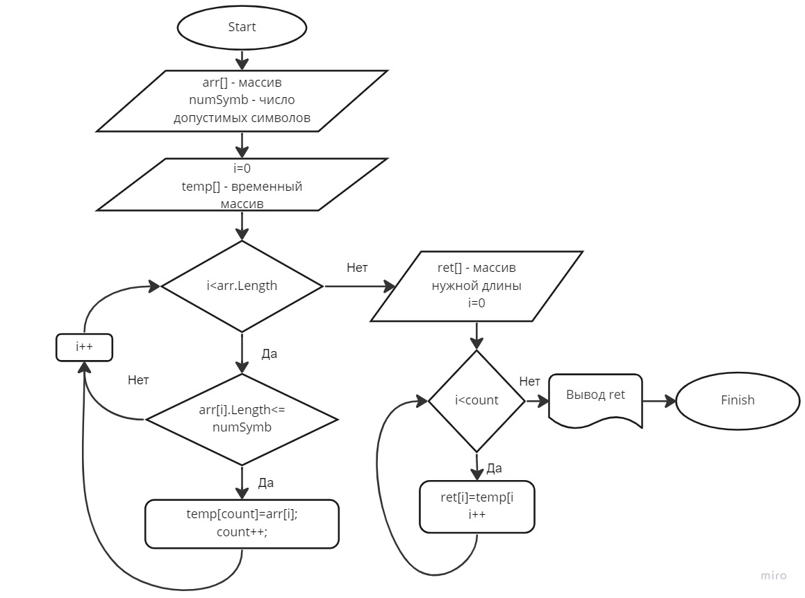

# Задание 

1. Содать репозиторий на GitHub.
2. Нарисовать блок схему алгоритма (можно обойтись блок схемой основной содержательной части, если вы выделите ее в отдельный метод).
3. Снабдить репозиторий оформленным текстовым описанием решения (файл README.md).
4. Написать программу, решающую поставленную задачу.
5. Исползьовать контроль версий в работе над этим небольшим проектом (не должгл быть так что все залито одним коммитом, как мимимум этапы 2,3 и 4 должны быть расположены в разных коммитах)

**Задача:** Написать программу, которая из имеющегося массива строк формирует массив из строк, длина которых меньше либо равна 3 символа. Первоначальный массив можно ввести с клавиатуры, либо задать на старте выполнения алгоритма. При решении не рекомендуется пользоваться коллекциями, лучше обойтис исключительно массивами.

# Реализация
Для реализации задачи методами групповой работы, создадим несколь веток в git:
* readme - для коррекции файла описания
* input - методы ввода информации
* engine - основной алгоритм создания массива
* output - вывод результата

В конечном счете сделаем merge всех веток в окончательный проект.

## Примеры

>["hello","2","world",":-)"]->["2",":-)"]

>["1234","1567","-2","computer science"]->["-2"]

>["Russia","Denmark","Kazan"]->[]

## Ввод первоначального массива (input)
Реализуем 3 варианта ввода первоначального массива:
* Случайным выбором из 3-х тестовых вариантов (при вводе пользователя пустой  строки)
* Поэтапном вводе значений массива (При вводе пользователя числа - количества элементов)
* Вводе массива ввиде строки с разделителем ";"

## Главный метод

Для реализации основного алгоритма создадим временный массив равный длине проверяемого массива и счетчик.
Поэлементно пройдем по массиву проверяемому, если условие выполняется, то записываем в массив под индексом счетчика текущий элемент и увеличиваем счетчик.
По окончанию нам известна нужная длина массива, создаем его, и записываем все что есть во временном.
Для наглядности приведем схему:

*На мозговом штурме команды решение с одной прогонкой массива и записью в строку, с последующей разбивкой строки в массив было отвергнуто  в связи со сложностью решения проблемы возможного наличия в тексе выбранного разделителя строки*